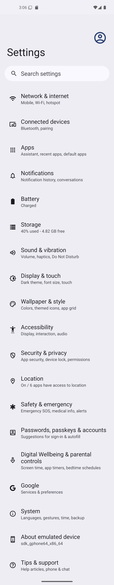
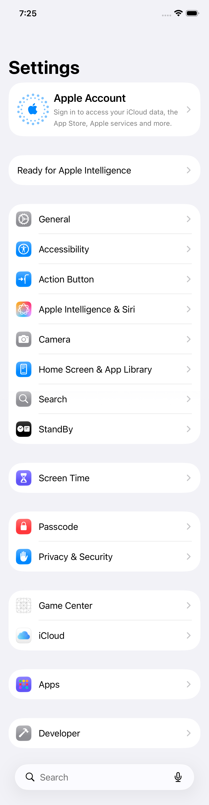

# Virtual Device Scrollshot

[](https://github.com/ashfaqahmed39/virtual-device-scrollshot/actions/workflows/ci.yml)
[](LICENSE)

Capture one continuous full-page PNG from the foreground app on an Android emulator, Android USB device, or iOS simulator.

Virtual Device Scrollshot uses Appium to control the real native scroll container and Sharp to remove repeated viewport content. It preserves fixed system and app chrome once and fails explicitly when frames cannot be stitched reliably.

For a complete local daemon implementation that provides device discovery, app installation and launch, standard screenshots, and full-page capture through an HTTP API, see [Local Daemon](https://github.com/ashfaqahmed39/local-daemon).

## Examples

| Android | iOS |
| --- | --- |
|  |  |

## Features

- Android emulators and USB-connected Android devices
- Booted iOS simulators on macOS
- Platform-aware CLI and JavaScript API
- Automatic first-run setup of pinned UiAutomator2 and XCUITest drivers
- Automatic target selection when exactly one eligible device is available
- Native accessibility-based scroll-container detection
- Scroll-to-top before capture
- Pixel-overlap stitching on Android and accessibility-anchor/pixel stitching on iOS
- No app reset, reinstall, relaunch, or data clearing
- Private Appium server bound to loopback for each capture

## Requirements

### Common

- Node.js `^20.19.0`, `^22.12.0`, or `>=24.0.0`
- npm `10+`
- The target app open, unlocked, and in the foreground
- Internet access on first capture to install the platform's pinned Appium driver

### Android

- macOS, Linux, or Windows
- Android SDK platform-tools (`adb`)
- An online emulator or USB device with USB debugging enabled

### iOS

- macOS and Xcode command-line tools
- A compatible Xcode simulator runtime
- A Booted iOS simulator; physical iPhones and iPads are not supported
- WebDriverAgent build access through Xcode

## Quick Start

Open the app at the page to capture.

Android is the default platform:

```bash
npx virtual-device-scrollshot --output android-page.png
```

Capture from a Booted iOS simulator:

```bash
npx virtual-device-scrollshot --platform ios --output ios-page.png
```

When multiple eligible targets exist, list and select one:

```bash
npx virtual-device-scrollshot --platform android --list-devices
npx virtual-device-scrollshot --platform android --device emulator-5554

npx virtual-device-scrollshot --platform ios --list-devices
npx virtual-device-scrollshot --platform ios --device <simulator-udid>
```

Appium drivers are installed under `~/.virtual-device-scrollshot/appium` on first use.

## Installation

```bash
npm install --global virtual-device-scrollshot
virtual-device-scrollshot --help
```

For the JavaScript API:

```bash
npm install virtual-device-scrollshot
```

For development:

```bash
git clone https://github.com/ashfaqahmed39/virtual-device-scrollshot.git
cd virtual-device-scrollshot
npm install
npm link
```

## CLI

```text
Usage:
  virtual-device-scrollshot [options]

Options:
  --platform <name>       android (default) or ios
  --device <id>           ADB device id or iOS simulator UDID
  --output, -o <path>     Output PNG path (default: full-page.png)
  --max-frames <number>   Maximum captured frames (default: 20)
  --max-height <pixels>   Maximum output height (default: 30000)
  --scroll-percent <0-1>  Scroll amount (Android: 0.72, iOS: 0.4)
  --list-devices          List targets for the selected platform and exit
  --verbose               Show Appium logs
  --help, -h              Show help
  --version, -v           Show version
```

## JavaScript API

### Android

```js
import fs from 'node:fs/promises'
import { captureFullPage } from 'virtual-device-scrollshot'

const result = await captureFullPage({
  deviceId: 'emulator-5554',
  maxFrames: 20,
  maxHeight: 30000,
  scrollPercent: 0.72,
  logger: console.log,
})

await fs.writeFile('android-page.png', result.buffer)
console.log(result.packageName, result.width, result.height)
```

### iOS

```js
import fs from 'node:fs/promises'
import { captureIosFullPage } from 'virtual-device-scrollshot'

const result = await captureIosFullPage({
  deviceId: '<simulator-udid>',
  maxFrames: 20,
  maxHeight: 30000,
  scrollPercent: 0.4,
  logger: console.log,
})

await fs.writeFile('ios-page.png', result.buffer)
console.log(result.bundleId, result.width, result.height)
```

Exports:

```js
captureFullPage(options)       // Android
captureIosFullPage(options)    // iOS simulator
listDevices()                  // Android targets
listIosSimulators()
ensureSetup({ logger })        // UiAutomator2
ensureUiAutomator2({ logger })
ensureXcuiTest({ logger })
```

Both capture functions return a PNG `buffer`, `width`, `height`, `frameCount`, and `deviceId`. Android results also contain `packageName`; iOS results contain `bundleId` and `platformVersion`.

## How It Works

### Android

1. Finds online targets with `adb devices -l` and detects the foreground package/activity.
2. Installs UiAutomator2 `8.1.0`, starts private Appium `3.5.2`, and attaches without relaunching.
3. Selects the largest visible node with `scrollable="true"` and scrolls it to the top.
4. Captures until UiAutomator2 reports the bottom, then stitches grayscale pixel overlaps.

### iOS

1. Finds available simulators through `xcrun simctl` and selects a Booted simulator.
2. Installs XCUITest `11.17.6`, starts private Appium, and attaches to the foreground app.
3. Selects the largest visible scroll view, table, collection view, or web view.
4. Detects scroll boundaries by comparing the content viewport and stitches frames using accessibility anchors with pixel-overlap fallback.

## Configuration

Android SDK discovery checks `ADB_PATH`, `ANDROID_HOME`, `ANDROID_SDK_ROOT`, and common SDK install paths.

Override the shared Appium data directory with:

```bash
VIRTUAL_DEVICE_SCROLLSHOT_APPIUM_HOME=/custom/path npx virtual-device-scrollshot
```

## Limitations

- iOS capture supports simulators only, not physical iOS devices.
- The app must expose a native scroll container through accessibility.
- Fully custom game/canvas surfaces may not expose scrollable content.
- DRM or secure windows can block screenshots.
- Animations, video, live feeds, and content changing during capture can prevent reliable stitching.
- Nested screens with multiple similarly sized scroll containers may select the wrong container.
- Capture leaves the selected screen at the bottom.

## Troubleshooting

### No Target Found

For Android, run `adb devices -l` and confirm the state is `device`, not `offline` or `unauthorized`.

For iOS, open Simulator, boot a device, then run:

```bash
xcrun simctl list devices available
npx virtual-device-scrollshot --platform ios --list-devices
```

### Foreground App Not Detected

Unlock the target, open the app, and leave the desired screen visible before capture. On iOS, SpringBoard cannot be captured.

### No Scrollable Content Found

The screen must expose a scrollable accessibility element. Inspect it with Appium Inspector, `uiautomator dump` on Android, or Xcode's Accessibility Inspector on iOS.

### WebDriverAgent Cannot Start

Confirm Xcode command-line tools and the selected simulator runtime are installed. Open Xcode once to accept licenses and complete first-launch setup.

### Overlap Cannot Be Determined

Pause animations and wait for lazy-loaded content before capture. Use `--verbose` to show Appium logs.

## Development

```bash
npm install
npm run check
npm test
```

Run the optional Android integration capture with a scrollable foreground app:

```bash
DEVICE_ID=emulator-5554 npm run test:integration
```

Run the optional iOS integration capture with a Booted simulator and scrollable foreground app:

```bash
IOS_DEVICE_ID=<simulator-udid> npm run test:integration:ios
```

## Security

Appium binds only to `127.0.0.1` on a temporary free port. The package does not expose an HTTP service, upload screenshots, reset apps, or collect device data. See [SECURITY.md](SECURITY.md).

## License

[MIT](LICENSE)
